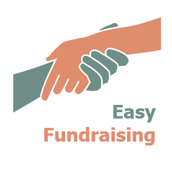
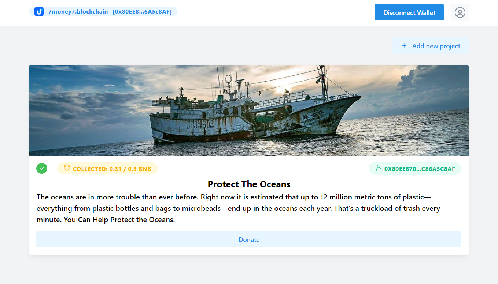

## EasyFundraising

<i>A blockchain fundraising platform where projects or people can create fundraising campaigns such as charity, fundraising for activities to improve the ecology of the planet, reduce environmental pollution and others.</i>

## Working app:

- link https://easy-fundraising.netlify.app/

## Video (demo):

- link: https://www.youtube.com/watch?v=ww_SJeILAhQ

## Integrations:

- Login with Unstoppable

## Built with:

### Blockchain:
1. Hardhat & Solidity -  smart contract deploy
2. ethers.js
3. [thirdweb storage](https://thirdweb.com/storage) - IPFS storage
4. Unstoppable Domains - "Login with Unstoppable" feature

### Frontend:
1. React
2. Mantine UI

### Backend:
1. NodeJs
2. Netlify - website hosting

## Steps to deploy this application:

1. Deploy the smart contract
2. Clone this repository and install all dependencies with **yarn**
3. Open `src/utils/config.js` file and complete all necessary constants
4. Start app with **yarn dev** command

## Preview

